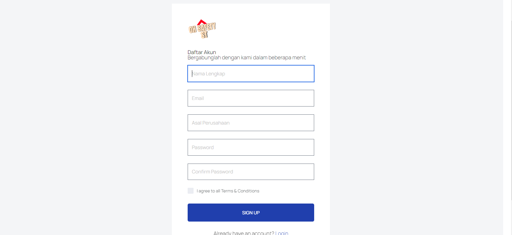
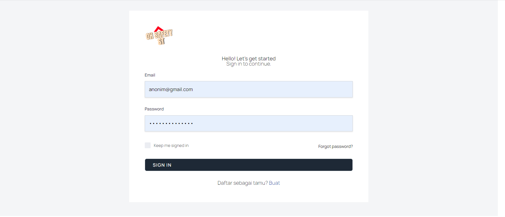
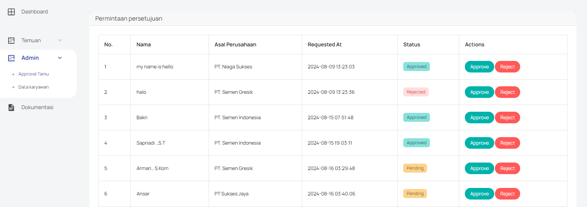
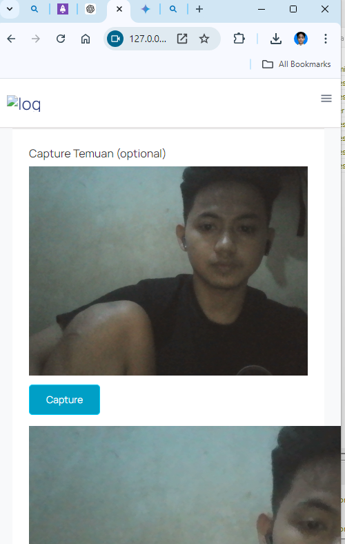
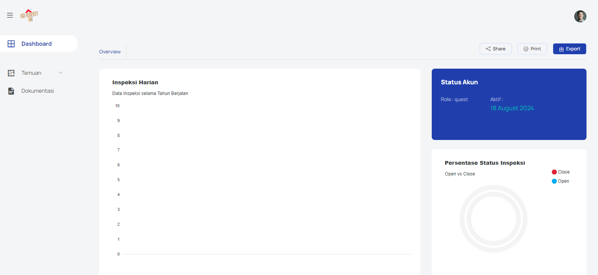
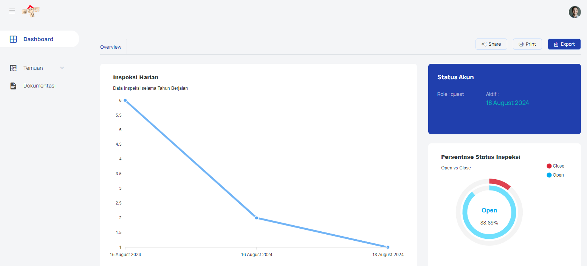
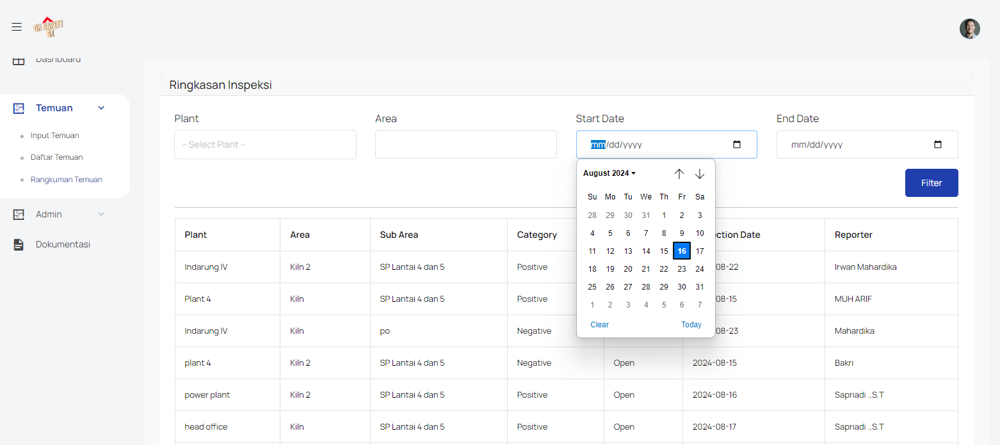

# Safety Observation Tour (SOT) - PT. Semen Tonasa

## Deskripsi
Aplikasi web **Safety Observation Tour (SOT)** adalah platform yang dirancang untuk memfasilitasi pendaftaran dan manajemen tur observasi keselamatan di PT. Semen Tonasa. Aplikasi ini menyediakan fitur untuk tamu atau perusahaan yang ingin ikut serta dalam observasi tur keselamatan, serta menawarkan dashboard khusus untuk pengguna dan administrator untuk memantau dan mengelola aktivitas terkait.

## Fitur
- **Registrasi Tamu/Perusahaan:** 
  - Tamu atau perusahaan dapat mendaftarkan diri untuk observasi tur keselamatan dengan mengisi informasi yang dibutuhkan.
  - Proses registrasi mudah dan intuitif.
  - Contoh tampilan form registrasi:
    

- **Login Pengguna:** 
  - Pengguna dapat login untuk mengakses dashboard masing-masing setelah proses registrasi.
  - Contoh tampilan halaman login:
    

- **Approval Tamu:**
  - Setelah registrasi, administrator dapat menyetujui atau menolak pendaftaran tamu melalui fitur approval yang tersedia.
  - Fitur ini memastikan hanya tamu yang telah diverifikasi yang dapat mengikuti tur observasi.
  - Contoh tampilan fitur approval tamu:
    

- **Inspeksi Tour:**
  - Setelah pengguna telah disetujui oleh admin maka pengguna sudah bisa melakukan inspeksi menggunakan webapps ini:
    

- **Dashboard User:** 
  - Setiap pengguna memiliki dashboard personal untuk melihat status registrasi, jadwal tur, dan informasi terkait lainnya.
  - Contoh tampilan dashboard pengguna:
    

- **Dashboard Admin:**
  - Administrator dapat mengelola seluruh proses tur observasi melalui dashboard ini, termasuk manajemen peserta, penjadwalan, monitoring pelaksanaan, dan approval tamu.
  - Contoh tampilan dashboard admin:
    

- **Summary:**
  - Fitur **Summary** memungkinkan pengguna untuk melihat dan memfilter data yang telah mereka input sendiri selama mengikuti tur observasi.
  - Fitur ini bersifat eksklusif, dimana pengguna hanya dapat melihat data yang mereka input sendiri, sementara administrator dapat melihat seluruh data yang diinput oleh semua pengguna.
  - Pengguna dapat memfilter data berdasarkan kriteria tertentu seperti tanggal, jenis observasi, dll.
  - Contoh tampilan fitur summary:
    

## Teknologi yang Digunakan
- **Frontend:** 
  - Bootstrap 5
- **Backend:**
  - Laravel 11
- **Database:** 
  - MySQL
- **Local Environment:**
  - Laragon

## Instalasi
1. Clone repositori ini ke lokal Anda:
    ```bash
    git clone https://github.com/username/repository.git
    ```
2. Masuk ke direktori proyek:
    ```bash
    cd directory-name
    ```
3. Install dependencies:
    ```bash
    composer install
    ```
4. Konfigurasi environment variables:
    - Salin file `.env.example` menjadi `.env`.
    - Atur variabel seperti `DB_CONNECTION`, `DB_DATABASE`, `DB_USERNAME`, dan `DB_PASSWORD`.

5. Jalankan migrasi database:
    ```bash
    php artisan migrate
    ```

6. Jalankan aplikasi:
    ```bash
    php artisan serve
    ```
    Akses aplikasi melalui [http://127.0.0.1:8000](http://127.0.0.1:8000).

## Kontribusi
Kontribusi sangat kami hargai. Silakan buat pull request atau ajukan issue untuk perbaikan atau fitur baru.

## Lisensi
Aplikasi ini dilisensikan di bawah lisensi [MIT](LICENSE).

## Kontak
Untuk informasi lebih lanjut, hubungi:
- **Nama:** MUH. ARIF
- **Email:** arifrpl123@gmail.com
